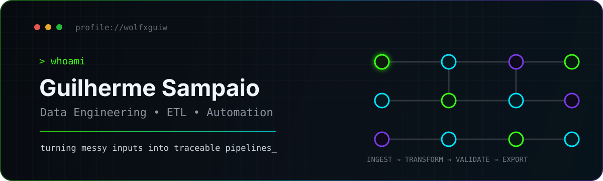

<p align="center">
  
</p>

<h1 align="center">Guilherme Sampaio</h1>

<p align="center">
  <strong>Data Engineering • ETL • Automation • Software Engineering</strong>
</p>

<p align="center">
  I like turning repetitive, messy workflows into deterministic, traceable systems.
  <br/>
  Currently building projects around <strong>data extraction, validation, document processing and automation</strong>.
</p>

<p align="center">
  <a href="https://github.com/wolfxguiw?tab=repositories">
    
  </a>
  <a href="https://github.com/wolfxguiw/rental-statement-etl">
    
  </a>
</p>

---

## `> focus --now`

```text
INGEST  →  EXTRACT  →  TRANSFORM  →  VALIDATE  →  EXPORT
               ↘ observability / traceability ↗
```

- **Data Engineering:** ETL pipelines, structured extraction and data-quality checks
- **Automation:** replacing repetitive operational work with reliable workflows
- **Document Processing:** PDFs, OCR fallback, normalization and validation
- **Engineering:** deterministic rules, testing, traceability and maintainable architecture

---

## `> stack --list`

### Data & automation

<p>
  
  
  
  
  
</p>

### Software engineering

<p>
  
  
  
  
  
</p>

### Tools I use in real projects

`pdfplumber` · `openpyxl` · `Pillow` · `Tesseract OCR` · `Selenium WebDriver` · `WPF` · `PyInstaller`

---

## `> projects --featured`

<table>
<tr>
<td width="50%" valign="top">

### 📊 [rental-statement-etl](https://github.com/wolfxguiw/rental-statement-etl)

Local ETL pipeline for extracting structured data from digital and scanned rental-statement PDFs.

**Highlights**
- native PDF extraction + local OCR fallback
- deterministic event classification
- normalization and data-quality validation
- SHA-256 duplicate detection
- traceable records and diagnostics
- structured Excel export

**Stack:** Python · pdfplumber · Tesseract · openpyxl

</td>
<td width="50%" valign="top">

### ⚡ [TarifaSync](https://github.com/wolfxguiw/TarifaSync-Showcase)

Windows application that centralizes monitoring, validation and organization of energy invoices across multiple consumer units.

**Highlights**
- authenticated session automation
- invoice verification and classification
- batch downloads
- duplicate prevention
- automated file organization
- automated test coverage

**Stack:** C# · .NET Framework · WPF · Selenium

</td>
</tr>
</table>

---

## `> engineering --principles`

```text
01. Don't invent data.
02. Validate before trusting.
03. Preserve traceability.
04. Automate repetitive work.
05. Prefer deterministic behavior.
06. Test the ugly edge cases.
```

---

## `> status`

```yaml
currently:
  direction: data engineering
  interests:
    - ETL and data pipelines
    - document processing
    - automation
    - data quality
    - backend engineering
  building: practical projects that solve real workflows
```

<p align="center">
  <sub>São Paulo, Brazil • always building, breaking, validating and rebuilding.</sub>
</p>
